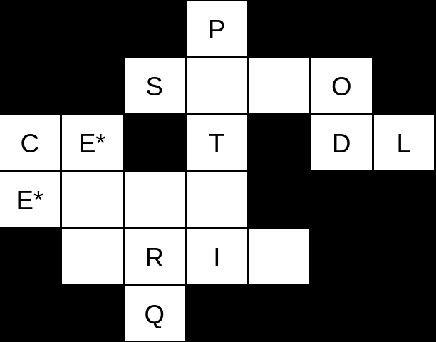

# KroZ (Aventura conversacional)

## Acciones a realizar

- `ir [n|s|e|o]`: Mueve al personaje a la habitación siguiente en la dirección indicada (norte, sur, este u oeste) si existe, en cuyo caso muestra una descripción de lo que hay en dicha habitación. Si no existe, el juego lo advierte al jugador.
- `mirar <objetivo>`: Da una descripción de algo en la habitación o un objeto del equipo
- `coger <objeto>`: Añade el objeto al equipo (si no está lleno)
- `dejar <objeto>`: Saca el objeto del equipo y lo suelta en la habitación
- `equipo`: Muestra los objetos y cuánto espacio queda
- `usar <objeto> <objetivo>`: Hace que interactúe un objeto del equipo con algo en la habitación u otro objeto del equipo
- `ayuda`: Muestra estas acciones con su descripción
- `<desconocido>`: Devuelve un mensaje de error

## Equipo

- Guarda los objetos (en el orden en el que se cogieron).
- Tiene un límite máximo de 2 objetos.

## Atributos del personaje

- Nombre: Se le pide al principio de la partida, y se usará siempre que el juego se dirija al jugador.
- Puntos de vida: Empieza con 3 y si llega a 0 el personaje muere y la partida acaba, volviendo al principio.

## Objetos para coger

- Llave (L): Abre la puerta de salida y finaliza el juego exitosamente.
- Espada oxidada (EO): Aparece aleatoriamente en cada partida en una de las dos casillas adyacentes a la de comienzo. Es capaz de matar a las ratas. Usada con Q se convierte en EB.
- Espada brillante (EB): Usada con el Sepulcro se convierte en EL.
- Espada legendaria (EL): Es capaz de matar al dragón.
- Quitaóxido: Usado con EO la convierte en EB (y se gasta y desaparece).
- Oro (O): Si se intenta coger antes de matar al dragón, este lanza su hálito de fuego y quita un punto de vida. Si se coge después, sale un mensaje adicional al final del juego.

## Otros elementos de habitación

- Comienzo
- Dragón: Puede morir con la EL. Si se usa otra espada contra él, no le hará nada y además le quitará 2 puntos de vida al personaje por fuego.
- Puerta: Finaliza el juego con la L.
- Trampa: Se acciona y quita 1 punto de vida cuando el jugador intenta ir al norte sin haber mirado antes en "una pared sospechosa" (citada en la descripción de la habitación en la que está la trampa).
- Ratas: Si se intenta pasar al sur sin matarlas antes con la EO, quitan 1 punto de vida.
- Sepulcro: Usada con EB la convierte en la EL, que puede matar al dragón.
- Inscripción: Tiene un texto grabado que se puede leer (mirar) pero que realmente no sirve para nada en el juego.

## Mapa del juego

C: Comienzo  
D: Dragón  
P: Puerta  
L: Llave  
E*: Espada oxidada  
O: Oro  
T: Trampa  
Q: Quitaóxido  
S: Sepulcro  
I: Inscripción  
R: Ratas  

Nota: La E* aparece en una habitación u otra aleatoriamente.
